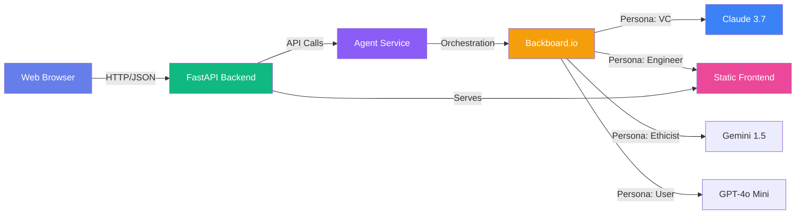

# 🚀 Startup Idea Validator

An AI-powered startup idea validation platform using [Backboard.io](https://backboard.io)'s intelligent memory service. Get comprehensive analysis of your startup concepts with persistent context and actionable insights.


## ✨ Features

- **🧠 AI-Powered Analysis**: Leverages advanced LLMs through Backboard.io for intelligent validation
- **💾 Persistent Memory**: Context-aware insights that learn from previous validations
- **📊 Multi-Dimensional Evaluation**: Analyzes market viability, competition, scalability, monetization, and risks
- **💬 Follow-Up Questions**: Interactive Q&A for deeper exploration of your idea
- **🎨 Modern UI**: Beautiful, responsive interface with glassmorphism and dark mode
- **⚡ Real-Time Processing**: Fast validation with streaming responses
- **🔐 Secure**: API key-based authentication with environment variable management

## 🏗️ Architecture



### Tech Stack

#### Backend
- **FastAPI**: Modern, high-performance web framework
- **Backboard SDK**: Official Python client for Backboard.io
- **Pydantic**: Data validation and settings management
- **Uvicorn**: Lightning-fast ASGI server

#### Frontend
- **Vanilla JavaScript**: No framework overhead, pure performance
- **Modern CSS**: Glassmorphism, gradients, and smooth animations
- **Semantic HTML**: Accessible and SEO-friendly markup

## 🚀 Quick Start

### Prerequisites

- Python 3.8 or higher
- Backboard.io API key ([Get one here](https://app.backboard.io/signup))
- pip (Python package manager)

### Installation

1. **Clone or navigate to the project directory**:
   ```bash
   cd startup-validator
   ```

2. **Create a virtual environment** (recommended):
   ```bash
   python -m venv venv
   source venv/bin/activate  # On Windows: venv\Scripts\activate
   ```

3. **Install dependencies**:
   ```bash
   pip install -r requirements.txt
   ```

4. **Set up environment variables**:
   ```bash
   cp .env.example .env
   ```
   
   Edit `.env` and add your keys:
   ```env
   # Server
   PORT=8000

   # Backboard
   BACKBOARD_API_KEY=your_key_here

   # Models
   LLM_PROVIDER_MAIN=openai
   MODEL_MAIN=gpt-4o
   
   LLM_PROVIDER_VC=openai
   MODEL_VC=gpt-4o
   
   # ... see .env.example for full list
   ```

5. **Run the application**:
   ```bash
   python main.py
   ```
   
   Or using uvicorn directly:
   ```bash
   uvicorn main:app --reload --port 8000
   ```

6. **Open your browser** and navigate to:
   ```
   http://localhost:8000
   ```

## 📖 Usage Guide

### Validating a Startup Idea

1. Click **"Start Validation"** on the welcome screen
2. Fill in the form with your startup details:
   - **Idea Name**: A catchy name for your startup
   - **Description**: Detailed explanation of what your startup does
   - **Target Market**: Your customer segment or audience
   - **Problem Being Solved**: The pain point you're addressing
   - **Unique Value** (optional): Your competitive advantage
3. Click **"Validate Idea"**
4. Wait for the AI analysis (typically 10-30 seconds)
5. Review comprehensive results including:
   - Executive summary
   - Key strengths
   - Concerns and risks
   - Recommended next steps
   - Full detailed analysis

### Asking Follow-Up Questions

After receiving validation results:
1. Scroll to the "Have Questions?" section
2. Type your question (e.g., "How can I differentiate from competitors?")
3. Click "Ask" or press Enter
4. Get context-aware answers based on your validated idea

### Understanding the Results

The validator analyzes your idea across six key dimensions:

1. **Market Viability** 📈
   - Market size and opportunity
   - Customer demand validation
   - Timing and market readiness

2. **Competition** 🎯
   - Competitive landscape
   - Your unique positioning
   - Barriers to entry

3. **Scalability** 📊
   - Growth potential
   - Operational scalability
   - Resource requirements

4. **Monetization** 💰
   - Revenue models
   - Pricing strategies
   - Unit economics

5. **Execution Risk** ⚠️
   - Technical challenges
   - Operational complexity
   - Resource constraints

6. **Innovation** 💡
   - Novelty and differentiation
   - Technology leverage
   - Market disruption potential

## 🔧 API Documentation

### Endpoints

#### `POST /api/validate`

Validate a startup idea.

**Request Body**:
```json
{
  "idea_name": "AI Meal Planner",
  "description": "An AI-powered app that creates personalized meal plans...",
  "target_market": "Health-conscious millennials",
  "problem_solving": "People struggle to plan healthy meals...",
  "unique_value": "Uses ML to learn preferences over time"
}
```

**Response**:
```json
{
  "thread_id": "thread_abc123",
  "assistant_id": "asst_xyz789",
  "input_idea": "AI Meal Planner...",
  "neutral_idea": "An algorithmic meal planning system...",
  "verdict": "This startup is viable but high risk due to...",
  "risk_signals": {
    "highConfidenceRisks": ["Scalability/Cost"]
  },
  "critics": {
    "vc": "Market is too small...",
    "engineer": "Data pipeline is complex..."
  }
}
```

#### `POST /api/follow-up`

Ask a follow-up question.

**Request Body**:
```json
{
  "thread_id": "thread_abc123",
  "question": "What monetization strategies would work best?"
}
```

**Response**:
```json
{
  "thread_id": "thread_abc123",
  "answer": "Based on your AI meal planning idea, I recommend..."
}
```

#### `GET /api/history/{thread_id}`

Retrieve conversation history for a validation thread.

#### `GET /health`

Health check endpoint.

**Response**:
```json
{
  "status": "healthy",
  "backboard_connected": true
}
```

### Interactive API Documentation

FastAPI provides automatic interactive documentation:

- **Swagger UI**: http://localhost:8000/docs
- **ReDoc**: http://localhost:8000/redoc

## 🎨 Customization

### Modifying the AI Prompt

Edit [services/backboard_service.py](file:///Users/sbose/git/agi-ventures/startup-validator/services/backboard_service.py) to customize the system prompt and analysis criteria.

### Styling the UI

All styles are in [static/css/styles.css](file:///Users/sbose/git/agi-ventures/startup-validator/static/css/styles.css). CSS custom properties make it easy to adjust colors, spacing, and effects:

```css
:root {
    --color-accent: #8b5cf6;  /* Primary accent color */
    --gradient-primary: linear-gradient(135deg, #667eea 0%, #764ba2 100%);
    /* ... more variables */
}
```

### Changing the LLM Model

In `backboard_service.py`, modify the model parameter:

```python
assistant = self.client.assistants.create(
    name="Startup Idea Validator",
    instructions=system_prompt,
    model="gpt-4-turbo-preview",  # Change this
    memory="Auto"
)
```

Backboard.io supports 2,200+ models including GPT-4, Claude, Gemini, and more.

## 🚀 Deployment

### Production Considerations

1. **Environment Variables**: Never commit `.env` files. Use secure secret management.

2. **CORS**: Update CORS settings in `main.py` for production:
   ```python
   app.add_middleware(
       CORSMiddleware,
       allow_origins=["https://yourdomain.com"],  # Specify exact origins
       allow_credentials=True,
       allow_methods=["*"],
       allow_headers=["*"],
   )
   ```

3. **HTTPS**: Always use HTTPS in production. Consider using:
   - Nginx as a reverse proxy
   - Let's Encrypt for SSL certificates
   - Cloud providers (AWS, GCP, Azure) with built-in SSL

4. **Process Management**: Use a process manager like:
   - **Gunicorn** with Uvicorn workers
   - **Supervisor** for process monitoring
   - **Docker** for containerization

### Example Docker Deployment

```dockerfile
FROM python:3.9-slim

WORKDIR /app

COPY requirements.txt .
RUN pip install --no-cache-dir -r requirements.txt

COPY . .

EXPOSE 8000

CMD ["uvicorn", "main:app", "--host", "0.0.0.0", "--port", "8000"]
```

### Scaling

- **Horizontal Scaling**: Deploy multiple instances behind a load balancer
- **Caching**: Implement Redis for session and response caching
- **Rate Limiting**: Add rate limiting to prevent abuse
- **Monitoring**: Use tools like Prometheus, Grafana, or Datadog

## 🧪 Testing

### Manual Testing Checklist

- [ ] Backend health check returns `200 OK`
- [ ] Form validation prevents empty submissions
- [ ] Validation request completes successfully
- [ ] Results display all sections (summary, strengths, concerns, steps)
- [ ] Follow-up questions work correctly
- [ ] UI is responsive on mobile devices
- [ ] Loading states appear during API calls
- [ ] Error messages display for failed requests

### Testing the Backend

```bash
# Test health endpoint
curl http://localhost:8000/health

# Test validation endpoint
curl -X POST http://localhost:8000/api/validate \
  -H "Content-Type: application/json" \
  -d '{
    "idea_name": "Test Idea",
    "description": "A test startup idea for validation",
    "target_market": "Test market",
    "problem_solving": "Solves a test problem"
  }'
```

## 🤝 Contributing

Contributions are welcome! Here's how you can help:

1. Fork the repository
2. Create a feature branch (`git checkout -b feature/amazing-feature`)
3. Commit your changes (`git commit -m 'Add amazing feature'`)
4. Push to the branch (`git push origin feature/amazing-feature`)
5. Open a Pull Request

## 📝 License

This project is open source and available under the MIT License.

## 🙏 Acknowledgments

- **Backboard.io** for providing the intelligent memory layer
- **FastAPI** for the excellent web framework
- **Google Fonts** for Inter and Space Grotesk typefaces

## 📧 Support

For issues and questions:
- Open an issue on GitHub
- Check [Backboard.io documentation](https://backboard.io)
- Review FastAPI docs for backend questions

---

**Built with ❤️ using Backboard.io AI Memory**
